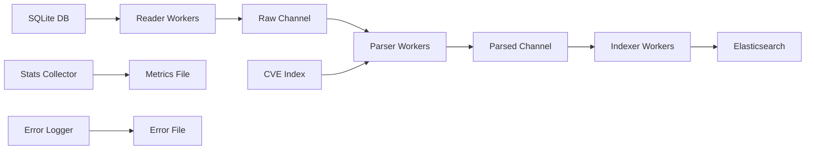

# SpiderFoot Fetcher

[](https://goreportcard.com/report/github.com/luhtaf/spiderfoot-fetcher)
[](https://golang.org)
[](https://opensource.org/licenses/MIT)
[](https://github.com/luhtaf/spiderfoot-fetcher)
[](https://github.com/luhtaf/spiderfoot-fetcher)

> High-performance concurrent pipeline for processing SpiderFoot scan results with CVE enrichment and CISA data integration.

## 🚀 Features

- **🔄 3-Stage Concurrent Pipeline**: Reader → Parser → Indexer with configurable worker pools
- **⚡ High Performance**: Concurrent processing with non-blocking channels
- **🛡️ CVE Enrichment**: Automatic CVE scoring with CISA KEV and EPSS integration
- **📊 Real-time Monitoring**: Suricata-style performance metrics and statistics
- **🔍 Smart Error Handling**: Detailed error logging with record traceability
- **⏰ Safe Timestamp Management**: Prevents duplicate processing during concurrent runs
- **📈 Performance Profiling**: Built-in pprof support for optimization

## 📋 Table of Contents

- [Installation](#installation)
- [Quick Start](#quick-start)
- [Configuration](#configuration)
- [Pipeline Architecture](#pipeline-architecture)
- [CVE Enrichment](#cve-enrichment)
- [Performance Monitoring](#performance-monitoring)
- [Error Handling](#error-handling)
- [Testing](#testing)
- [Contributing](#contributing)
- [License](#license)

## 🛠️ Installation

### Prerequisites
- Go 1.21 or higher
- SQLite3 (SpiderFoot database)
- Elasticsearch 7.x/8.x cluster
- Access to CVE data and EPSS indices

### Install from Source
```bash
git clone https://github.com/luhtaf/spiderfoot-fetcher.git
cd spiderfoot-fetcher
go mod tidy
go build -o spiderfoot-fetcher
```

### Docker Installation
```bash
docker pull luhtaf/spiderfoot-fetcher:latest
```

## 🚀 Quick Start

### 1. Configure the Pipeline
```bash
cp config.yaml.example config.yaml
# Edit config.yaml with your settings
```

### 2. Run the Pipeline
```bash
# Development mode (dry run)
./spiderfoot-fetcher

# Production mode (edit config.yaml first)
./spiderfoot-fetcher
```

### 3. Schedule for Production
```bash
# Add to crontab for hourly execution
0 * * * * /path/to/spiderfoot-fetcher >> /var/log/spiderfoot-pipeline.log 2>&1

# Or use systemd timer
sudo systemctl enable --now spiderfoot-fetcher.timer
```

### 4. Monitor Performance
```bash
# Real-time stats
tail -f pipeline_stats.json

# Error monitoring
tail -f error.log

# Performance profiling
go tool pprof http://localhost:6060/debug/pprof/profile
```

## ⚙️ Configuration

The pipeline is configured via `config.yaml`:

```yaml
# Database Configuration
database:
  path: "spiderfoot.db"
  
# Pipeline Workers Configuration
workers:
  reader: 2      # SQL reader workers
  parser: 4      # Data parser workers  
  indexer: 3     # Elasticsearch indexer workers

# Batch Configuration
batch:
  size: 100      # Records per batch

# Elasticsearch Configuration
elasticsearch:
  url: "http://localhost:9200"
  username: "elastic"
  password: "changeme"
  verify_certs: false
  index: "spiderfoot"
  cve_index: "go-list-cve-*"
  epss_index: "epss-scores"

# Application Configuration
app:
  type: "development"  # "production" for live indexing
  version: 2
  timestamp_file: "timestamp_cron.txt"
  fallback_hours: 12
  error_log: "error.log"
  organization_data: "organization_data.csv"

# Statistics Configuration
stats:
  enabled: true
  interval: 30s
  file: "pipeline_stats.json"
```

### Environment Variables
```bash
export SPIDERFOOT_DB_PATH="/path/to/spiderfoot.db"
export ELASTICSEARCH_URL="https://elasticsearch:9200"
export ELASTICSEARCH_USERNAME="elastic"
export ELASTICSEARCH_PASSWORD="your-password"
```

## 🏢 Organization Data

### CSV Format
Create `organization_data.csv` with organization to subsektor mapping:

```csv
organisasi,subsektor
Bank Bni,Perbankan
Bank Bri,Perbankan
Rumah Sakit Siloam Jakarta,Kesehatan
Telkom Indonesia,Telekomunikasi
Pln,Energi
Garuda Indonesia,Transportasi
Universitas Indonesia,Pendidikan
```

### Configuration
```yaml
app:
  organization_data: "organization_data.csv"  # Path to CSV file
```

### Behavior
- **Automatic Loading**: CSV loaded at startup with logging
- **Graceful Fallback**: Missing file results in empty subsektor fields
- **Case Sensitive**: Exact match required between scan name and CSV data
- **Flexible Format**: Support for spaces and special characters in names

## 📦 Deployment Patterns

### 🕐 Cron Job (Recommended)
```bash
# Every hour at minute 0
0 * * * * /opt/spiderfoot-fetcher/spiderfoot-fetcher >> /var/log/spiderfoot.log 2>&1

# Every 30 minutes
*/30 * * * * /opt/spiderfoot-fetcher/spiderfoot-fetcher

# Daily at 2 AM with 24-hour fallback
0 2 * * * /opt/spiderfoot-fetcher/spiderfoot-fetcher
```

### 🐳 Docker Deployment
```bash
# One-time execution
docker run --rm -v /path/to/config:/config luhtaf/spiderfoot-fetcher

# With cron in container
docker run -d --name spiderfoot-cron \
  -v /path/to/config:/config \
  -v /path/to/db:/data \
  luhtaf/spiderfoot-fetcher:latest
```

### ⚙️ Systemd Service + Timer
```ini
# /etc/systemd/system/spiderfoot-fetcher.service
[Unit]
Description=SpiderFoot to Elasticsearch Pipeline
After=network.target

[Service]
Type=oneshot
User=spiderfoot
WorkingDirectory=/opt/spiderfoot-fetcher
ExecStart=/opt/spiderfoot-fetcher/spiderfoot-fetcher
StandardOutput=journal
StandardError=journal

# /etc/systemd/system/spiderfoot-fetcher.timer
[Unit]
Description=Run SpiderFoot Pipeline every hour
Requires=spiderfoot-fetcher.service

[Timer]
OnCalendar=hourly
Persistent=true

[Install]
WantedBy=timers.target
```

### 🔄 CI/CD Integration
```yaml
# GitHub Actions example
name: SpiderFoot Data Pipeline
on:
  schedule:
    - cron: '0 */2 * * *'  # Every 2 hours
jobs:
  pipeline:
    runs-on: ubuntu-latest
    steps:
      - uses: actions/checkout@v3
      - name: Run Pipeline
        run: ./spiderfoot-fetcher
```

## 🏗️ Pipeline Architecture

### 🔄 Short-Lived Worker Model

This pipeline uses a **short-lived worker architecture** designed for batch processing:

- **📅 Batch-Oriented**: Processes data between timestamps (e.g., last 12 hours)
- **⏱️ Finite Execution**: Workers finish when no more data to process
- **🔄 Cron-Style**: Designed to run periodically (via cron/scheduler)
- **💾 State Persistence**: Saves timestamp for next run continuity

**vs Long-Running Workers:**
| Aspect | Short-Lived (This Pipeline) | Long-Running Workers ([nvd-fetcher](https://github.com/luhtaf/nvd-fetcher)) |
|--------|----------------------------|---------------------|
| **Lifecycle** | Start → Process → Exit | Start → Listen Forever |
| **Worker Pattern** | Spawn per batch → Exit when done | 1000+ workers always listening |
| **Processing Model** | Batch-oriented (100 records/batch) | Per-item (1 CVE/worker) |
| **Memory Profile** | Memory efficient (periodic) | CPU efficient (continuous) |
| **Use Case** | ETL jobs, scheduled processing | Stream processing, real-time |
| **Resource Usage** | Periodic, bounded | Continuous, high throughput |
| **Failure Recovery** | Restart from last timestamp | In-memory state loss |
| **Concurrency** | Finite workers per stage | Massive parallelism (1000+ workers) |
| **Deployment** | Cron job, batch scheduler | Always-on service |

### Stage 1: Reader Workers (Short-Lived)
- **Purpose**: Extract records from SpiderFoot SQLite database
- **Lifecycle**: Query database → Send to channel → **Exit when no more records**
- **Pattern**: `for { query() → send() → offset++ }` until empty result
- **Concurrency**: Multiple workers with offset-based pagination (Worker 1: offset 0, Worker 2: offset 100, etc.)
- **Completion**: Workers naturally terminate when their query returns empty
- **Safety**: Timestamp range isolation (`last_run < timestamp <= now`)

### Stage 2: Parser Workers (Channel-Driven)
- **Purpose**: Parse and enrich scan data until channel closes
- **Lifecycle**: `for record := range rawChan` → **Exit when channel closes**
- **Processing**: 
  - Grok pattern parsing for organization metadata
  - CVE enrichment with CISA KEV and EPSS data (with caching)
  - Data validation and transformation
- **Pattern**: Channel consumer that terminates when upstream closes
- **Intelligence**: Conditional processing based on scan type

### Stage 3: Indexer Workers (Bounded)
- **Purpose**: Index processed data to Elasticsearch until completion
- **Lifecycle**: `for record := range parsedChan` → **Exit when channel closes**
- **Features**: 
  - Dynamic index naming with date partitioning
  - Individual document indexing (not bulk)
  - Error resilience with structured logging
- **Pattern**: Channel consumer with finite data set
- **Monitoring**: Per-operation performance tracking

### 🔄 **Short-Lived vs Long-Running Comparison**

**This Pipeline (Short-Lived)**:
```go
// Reader: Query until no more data
for {
    rows := db.Query("... LIMIT 100 OFFSET ?", offset)
    if len(records) == 0 {
        return // 🏁 Worker exits naturally
    }
    // Process batch and increment offset
}

// Parser: Process until channel closes  
for record := range rawChan {
    process(record)
} // 🏁 Worker exits when channel closes
```

**nvd-fetcher (Long-Running)**:
```go
// 1000 workers always listening
for i := 0; i < 1000; i++ {
    go func() {
        for cveTask := range taskChan { // 🔄 Never exits
            process(cveTask)           // 1 CVE per worker
        }
    }()
}
// Workers run forever, waiting for next CVE
```



## 🛡️ CVE Enrichment

### Automatic CVE Processing
- **Detection**: Identifies `VULNERABILITY_CVE_*` scan types
- **Enrichment Source**: Queries `go-list-cve-*` Elasticsearch indices
- **Caching**: In-memory LRU cache for performance optimization

### CISA KEV Integration
- **CISA Data**: Known Exploited Vulnerabilities catalog
- **Fields Added**:
  ```json
  {
    "hasCisa": true,
    "cisa": {
      "cisaActionDue": "2022-04-15",
      "cisaExploitAdd": "2022-03-25", 
      "cisaRequiredAction": "Apply updates per vendor instructions.",
      "cisaVulnerabilityName": "HP OpenView Network Node Manager RCE"
    }
  }
  ```

### EPSS Integration
- **EPSS Data**: Exploit Prediction Scoring System from `epss-scores` index
- **Fields Added**:
  ```json
  {
    "hasEpss": true,
    "epss": {
      "cve": "CVE-2021-44228",
      "epss": "0.973730000",
      "percentile": "0.999940000", 
      "date": "2024-10-01",
      "timestamp": "2024-10-02T10:00:59.442658735+07:00"
    }
  }
  ```

### Scoring Logic
1. **Prefer CVSS v3.1** over v2.0 when available
2. **Fallback hierarchy**: v3 → v2 → base score
3. **Severity mapping**: Numeric score to categorical severity
4. **EPSS enrichment**: Adds exploit prediction probability

## 📊 Performance Monitoring

### Real-time Statistics
```json
{
  "timestamp": "2025-09-23T10:30:00Z",
  "reader": {
    "records_per_second": 150.5,
    "avg_processing_time_ms": 45.2,
    "active_workers": 2,
    "total_processed": 3010,
    "error_count": 0
  },
  "parser": {
    "records_per_second": 89.3,
    "avg_processing_time_ms": 112.7,
    "active_workers": 4,
    "queue_depth": 234,
    "error_count": 2
  },
  "indexer": {
    "records_per_second": 92.1,
    "avg_processing_time_ms": 67.8,
    "active_workers": 3,
    "error_count": 1
  },
  "uptime": "2h34m12s"
}
```

### Performance Tuning Guide
- **Reader Bottleneck**: Increase database connections or optimize SQL
- **Parser Bottleneck**: Add parser workers or optimize CVE enrichment
- **Indexer Bottleneck**: Tune Elasticsearch bulk settings or add workers
- **Memory Usage**: Monitor queue depths and adjust batch sizes

## 🔍 Error Handling

### Structured Error Logging
```json
{
  "timestamp": "2025-09-23T10:30:00Z",
  "stage": "parser",
  "record_id": "abc123hash",
  "scan_name": "security_audit_sektor_finance_organisasi_bank_xyz_target_10.0.1.100",
  "error": "CVE enrichment timeout: connection to elasticsearch failed"
}
```

### Error Recovery Strategies
- **Transient Failures**: Automatic retry with exponential backoff
- **Data Validation**: Skip malformed records with detailed logging
- **Resource Constraints**: Circuit breaker pattern for external services
- **Graceful Degradation**: Continue processing without enrichment when CVE service unavailable

## 🧪 Testing

### Running Tests
```bash
# Run all tests
go test ./...

# Run tests with coverage
go test -cover ./...

# Run tests with detailed coverage report
go test -coverprofile=coverage.out ./...
go tool cover -html=coverage.out

# Run benchmarks
go test -bench=. ./...

# Run race condition detection
go test -race ./...
```

### Test Categories
- **Unit Tests**: Individual component testing
- **Integration Tests**: Pipeline stage integration
- **Performance Tests**: Benchmark critical paths
- **Mock Tests**: External service simulation

### Test Coverage Goals
- **Overall Coverage**: >85%
- **Critical Path Coverage**: >95%
- **Error Path Coverage**: >80%

## 🤝 Contributing

### Development Setup
```bash
git clone https://github.com/luhtaf/spiderfoot-fetcher.git
cd spiderfoot-fetcher
go mod tidy
make setup
```

### Code Standards
- **Formatting**: `gofmt` and `goimports`
- **Linting**: `golangci-lint run`
- **Testing**: Minimum 85% coverage
- **Documentation**: Godoc for all public APIs

### Pull Request Process
1. Fork the repository
2. Create feature branch (`git checkout -b feature/amazing-feature`)
3. Run tests (`make test`)
4. Commit changes (`git commit -m 'Add amazing feature'`)
5. Push branch (`git push origin feature/amazing-feature`)
6. Open Pull Request

## 📄 License

This project is licensed under the MIT License - see the [LICENSE](LICENSE) file for details.

## 🙏 Acknowledgments

- [SpiderFoot](https://github.com/smicallef/spiderfoot) - Open source intelligence automation
- [Elasticsearch](https://github.com/elastic/elasticsearch) - Search and analytics engine
- [CISA KEV](https://www.cisa.gov/known-exploited-vulnerabilities) - Known Exploited Vulnerabilities catalog

## 📞 Support

- **Issues**: [GitHub Issues](https://github.com/luhtaf/spiderfoot-fetcher/issues)
- **Discussions**: [GitHub Discussions](https://github.com/luhtaf/spiderfoot-fetcher/discussions)
- **Security**: security@luhtaf.dev

---

<div align="center">
Made with ❤️ by <a href="https://github.com/luhtaf">luhtaf</a>
</div>